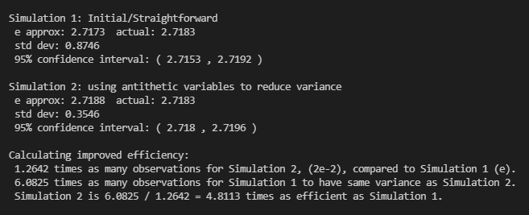
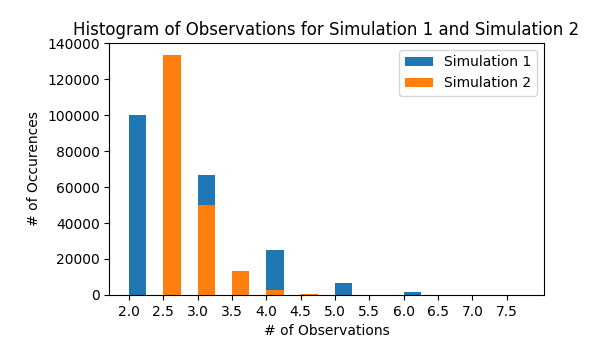

# Simulating-e-

Approximating $e$ with simulations based on the paper ["Estimating the Value of e by Simulation"](https://www.jstor.org/stable/2685243?seq=1#page_scan_tab_contents) by K. G. Russell.

